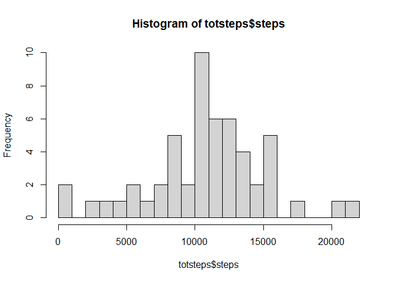
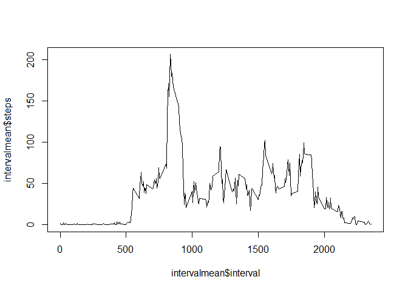
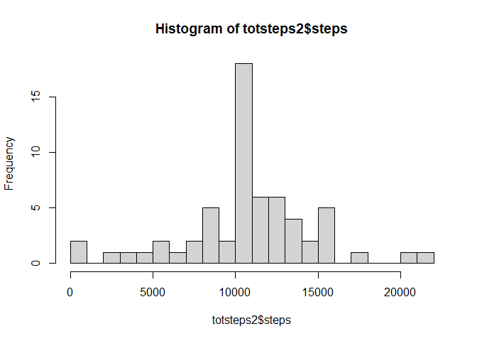

<font size = "5">Author - Manish Shah 11/11/2022</font>


## Loading and preprocessing the data


```r
actdata<-read.table(unz("activity.zip","activity.csv"),header=T,sep=",")
```

## What is mean total number of steps taken per day?
1.1 - Calculating the total number of steps per day and graphing a histogram with the data  


```r
totsteps<-aggregate(steps~date,data=actdata,FUN=sum,na.rm=TRUE)
hist(totsteps$steps,breaks = 20)  
```

<!-- -->

```r
meantotsteps<-mean(totsteps$steps)
mediantotsteps<-median(totsteps$steps)
```
1.2 - Calculating the mean steps per day

Mean of total number of steps is 1.0766189\times 10^{4}

1.3 - Calculating the mean steps per day

Median of total number of steps is 10765


## What is the average daily activity pattern?

2.1 - Calculating average by intervals and plotting it

```r
intervalmean<-aggregate(steps~interval,data=actdata,FUN=mean,na.rm=TRUE)
plot(intervalmean$interval,intervalmean$steps,type="l")
```

<!-- -->

```r
intervalmaxmean<-intervalmean[which.max(intervalmean$steps),]$interval
```

2.2 - The interval with maximum average number of steps is 835

## Imputing missing values


```r
missingval<-sum(is.na(actdata$steps))
```

3.1 - Number of mising values in the dataset are 2304

3.2 - 
Using a strategy for filing in missing values with the mean of intervals. 

Adding a new function to return mean steps for a specific interval

```r
meanstepsbyint<-function(interval){
    intervalmean[intervalmean$interval==interval,]$steps
}
```

3.3 - 
Copying dataset to a new dataset

```r
actdata2<-actdata
```

Replacing NAs in new dataset

```r
counta=0
for(i in 1:nrow(actdata2)){
  if(is.na(actdata2[i,]$steps)){
    actdata2[i,]$steps<-meanstepsbyint(actdata2[i,]$interval)
    counta=counta+1
  }
}
```

2304 values replaced with mean steps by interval

3.4 - Calculating the total number of steps per day and graphing a histogram with the new dataset with no missing values  


```r
totsteps2<-aggregate(steps~date,data=actdata2,FUN=sum,na.rm=TRUE)
hist(totsteps2$steps,breaks = 20)  
```

<!-- -->

```r
meantotsteps2<-mean(totsteps2$steps)
mediantotsteps2<-median(totsteps2$steps)
```

The mean total steps per day with new dataset is 1.0766189\times 10^{4}

The median total steps per day with new dataset is 1.0766189\times 10^{4}

There mean before and after imputing data stays same with a very little difference with median


## Are there differences in activity patterns between weekdays and weekends?

Converting date field to type date from a character

```r
actdata2$date<-as.Date(actdata2$date)
```

4.1 - 
Adding a field to identify day of the week and then categorize it into weekday or weekend

```r
actdata2$day<-weekdays(actdata2$date)
for(i in 1:nrow(actdata2)){
    if(actdata2[i,]$day=="Saturday"||actdata2[i,]$day=="Sunday"){
        actdata2[i,]$day="Weekend"
    }
    else{
        actdata2[i,]$day="Weekday"
    }
}
```


4.2 - 
Creating a mean of steps by interval and weekday/weekend

```r
intervalwdaymean<-aggregate(steps~interval+day,data=actdata2,FUN=mean,na.rm=TRUE)
```

4.3 - Panel plot

```r
library(lattice)
xyplot(steps~interval|factor(day),data=actdata2,aspect=1/2,type="l")
```

<!-- -->

